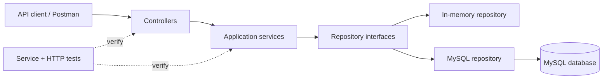

# Course Registration API

[](https://github.com/Robert-Pelot/courseRegistrationAPI/actions/workflows/ci.yml)
[](https://dotnet.microsoft.com/)

A REST API for managing courses, institutional core goals, course-to-goal assignments, and semester offerings. The project demonstrates layered ASP.NET Core design, dependency injection, input validation, standardized error responses, optional MySQL persistence, and automated testing.

**Portfolio case study:** [From CRUD Endpoints to an API Architecture](https://mystorageaccountusasa.z13.web.core.windows.net/projects/crud-to-api-architecture.html)  
**Portfolio:** [Life in Your 50s — Projects](https://mystorageaccountusasa.z13.web.core.windows.net/projects.html)

## 30-second overview

| | |
|---|---|
| **Problem** | Manage courses, core goals, assignments, and semester offerings through a consistent API |
| **Stack** | C#, ASP.NET Core, .NET 10, MySQL |
| **Architecture** | Controllers → services → repositories → in-memory or MySQL persistence |
| **API behavior** | Validation, conflict handling, normalized identifiers, standardized problem details |
| **Quality** | Service tests, HTTP integration tests, GitHub Actions CI |
| **Portfolio value** | Shows how a basic CRUD project evolved into a layered API architecture |

## Architecture



The default in-memory repository keeps the project easy to run and test. The MySQL implementation demonstrates the same application behavior against relational persistence without changing the controller/service contract.

## What this demonstrates

- RESTful CRUD endpoint design and HTTP status handling
- Layered application structure with controllers, services, and repositories
- Dependency injection and interchangeable persistence implementations
- Input validation and RFC 9457-style problem details
- Case-insensitive, whitespace-normalized identifiers
- Relational modeling for courses, core goals, assignments, and offerings
- Parameterized asynchronous MySQL queries
- Transactional multi-row assignments
- Automated service and HTTP integration testing
- GitHub Actions continuous integration

## Run locally

### Requirements

- [.NET 10 SDK](https://dotnet.microsoft.com/download/dotnet/10.0)
- Optional: MySQL 8 or a compatible server

The default in-memory mode includes a small sample data set and does not require a database.

```bash
dotnet restore tests/CourseRegistration.Api.Tests/CourseRegistration.Api.Tests.csproj
dotnet run --project src/CourseRegistration.Api/CourseRegistration.Api.csproj
```

The API listens on `http://localhost:5080` when launched with the included development profile.

## Run the checks

```bash
dotnet build tests/CourseRegistration.Api.Tests/CourseRegistration.Api.Tests.csproj --configuration Release
dotnet test tests/CourseRegistration.Api.Tests/CourseRegistration.Api.Tests.csproj --configuration Release --no-build
```

The CI workflow repeats the build and test checks on GitHub.

## API endpoints

| Method | Path | Purpose |
| --- | --- | --- |
| `GET` | `/api/courses` | List courses |
| `GET` | `/api/courses/{name}` | Get one course |
| `POST` | `/api/courses` | Create a course |
| `PUT` | `/api/courses/{name}` | Update a course |
| `DELETE` | `/api/courses/{name}` | Delete a course |
| `GET` | `/api/core-goals` | List core goals |
| `GET` | `/api/core-goals/{id}?includeCourses=true` | Get a core goal, optionally with assigned courses |
| `POST` | `/api/core-goals` | Create a core goal |
| `PUT` | `/api/core-goals/{id}` | Update a core goal |
| `POST` | `/api/core-goals/{id}/courses` | Assign existing courses to a goal |
| `DELETE` | `/api/core-goals/{id}` | Delete a core goal and its assignments |
| `GET` | `/api/offerings?semester={semester}` | Find offerings, optionally filtered by `goalId` and `department` |

Course names, goal IDs, and department codes are normalized to uppercase. Leading, trailing, and repeated spaces in identifiers are removed.

### Example

Create a course:

```bash
curl -X POST http://localhost:5080/api/courses \
  -H "Content-Type: application/json" \
  -d '{
    "name": "CSCI 495",
    "title": "Software Engineering Project",
    "credits": 3,
    "description": "Team-based development of a production-oriented software project."
  }'
```

Filter Spring 2026 offerings to the CSCI department:

```bash
curl "http://localhost:5080/api/offerings?semester=Spring%202026&department=CSCI"
```

## Optional MySQL persistence

1. Create and seed the schema:

   ```bash
   mysql -u root -p < database/schema.sql
   ```

2. Supply the provider and connection string through environment variables. Do not commit database credentials.

   ```powershell
   $env:Storage__Provider = "MySql"
   $env:ConnectionStrings__CourseRegistration = "Server=localhost;Database=course_registration;User ID=YOUR_USER;Password=YOUR_PASSWORD"
   dotnet run --project src/CourseRegistration.Api/CourseRegistration.Api.csproj
   ```

The application uses a new pooled connection for each repository operation. SQL values are passed as parameters, and multi-row course assignments run inside a transaction.

## Design decisions and tradeoffs

- **In-memory first:** the zero-configuration default makes the API immediately runnable and keeps automated tests simple.
- **Repository abstraction:** the application can switch between in-memory and MySQL persistence without changing endpoint behavior.
- **Service layer:** validation and application rules live outside controllers so they can be tested independently.
- **Normalized identifiers:** course names, goal IDs, and department codes are normalized to reduce accidental duplicates and inconsistent queries.
- **Parameterized SQL:** database values are never composed directly into SQL strings.
- **No authentication yet:** authentication and authorization are intentionally outside the current project scope rather than being represented as production-ready controls.

## Project structure

```text
src/CourseRegistration.Api/
  Controllers/       HTTP endpoints
  Data/              In-memory and MySQL repositories
  Exceptions/        Domain-specific failures
  Infrastructure/    Centralized API error handling
  Models/            Resources and request contracts
  Services/          Validation and application logic
tests/CourseRegistration.Api.Tests/
database/schema.sql
```

## Current limitations

- In-memory data resets whenever the process restarts.
- A MySQL server is optional and is not required for the automated test suite.
- Authentication and authorization are not implemented.
- Production deployment would require protected secrets, production database configuration, monitoring, and additional operational controls.

## Project history

This standalone portfolio edition evolved from a CSCI 330 course project completed in Spring 2026. The original GitHub Classroom repository and its commit history remain under the CCU Computing organization; classroom scaffolding and superseded copies were intentionally omitted from this portfolio version.

The deeper design story is documented in the accompanying portfolio case study: [From CRUD Endpoints to an API Architecture](https://mystorageaccountusasa.z13.web.core.windows.net/projects/crud-to-api-architecture.html).
